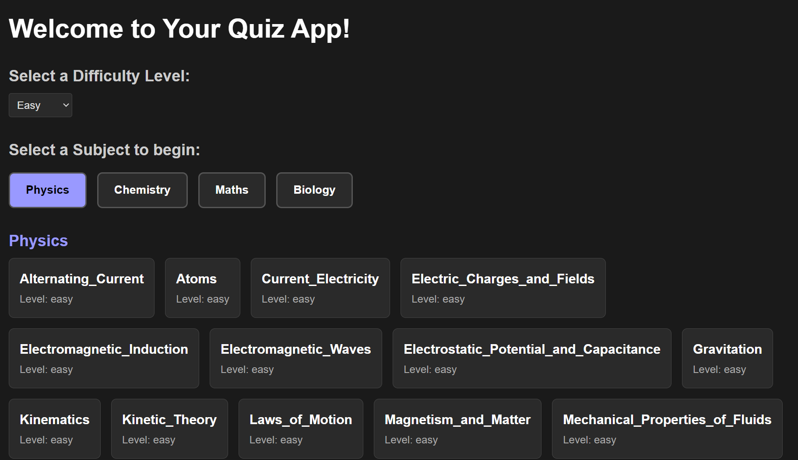
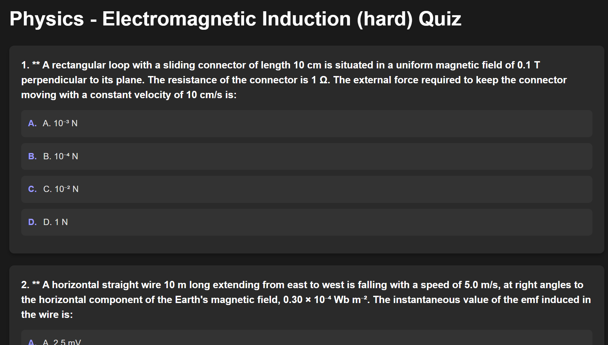
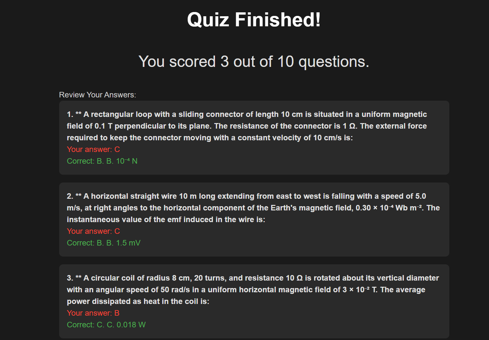

# KCET MCQ Quiz App

Live Website:
https://kce-tmcqs.vercel.app

Demo Video:[MCQS Demo](kcetdemo.mp4)

Screen Shots

Tech Stack:
- Next.js 16
- MongoDB Atlas
- Mongoose
- Vercel Deployment

Features:
- Subject selection (Physics, Chemistry, Maths, Biology)
- Difficulty levels (Easy, Medium, Hard)
- Dynamic chapter loading
- MongoDB-powered question fetching
- Production-ready deployment

Environment Variables:
- MONGODB_URI (stored securely in Vercel)

Author:
Disha P
